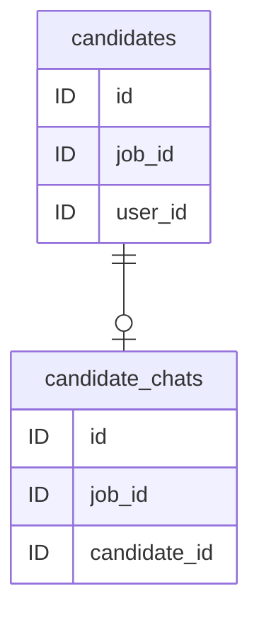

```mermaid
erDiagram
  candidates ||--o| candidate_chats : ""

  candidates {
    ID id
    ID job_id
    ID user_id
  }
  candidate_chats {
    ID id
    ID job_id
    ID candidate_id
  }
```

| キー | 名称 |
| --- | --- |
| candidate | 候補者 |
| candidate_chat | 候補者チャット |

- 企業と候補者間で1つのチャットを持てる
