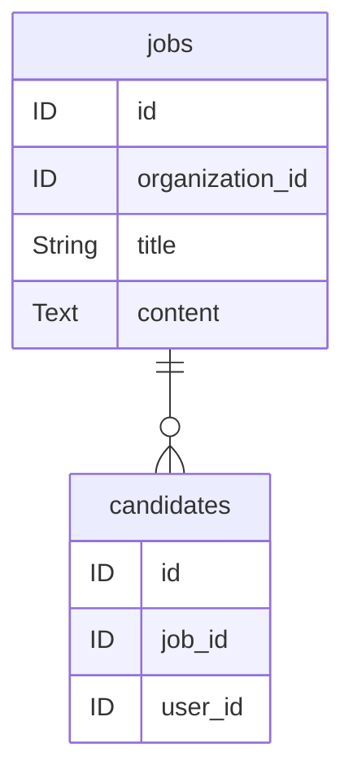

```mermaid
erDiagram
  jobs ||--o{ candidates : ""

  jobs {
    ID id
    ID organization_id
    String title
    Text content
  }
  candidates {
    ID id
    ID job_id
    ID user_id
  }
```

| キー | 名称 |
| --- | --- |
| job | 仕事募集記事 |
| candidate | 候補者 |

- 仕事募集記事は複数の候補者を持てる
