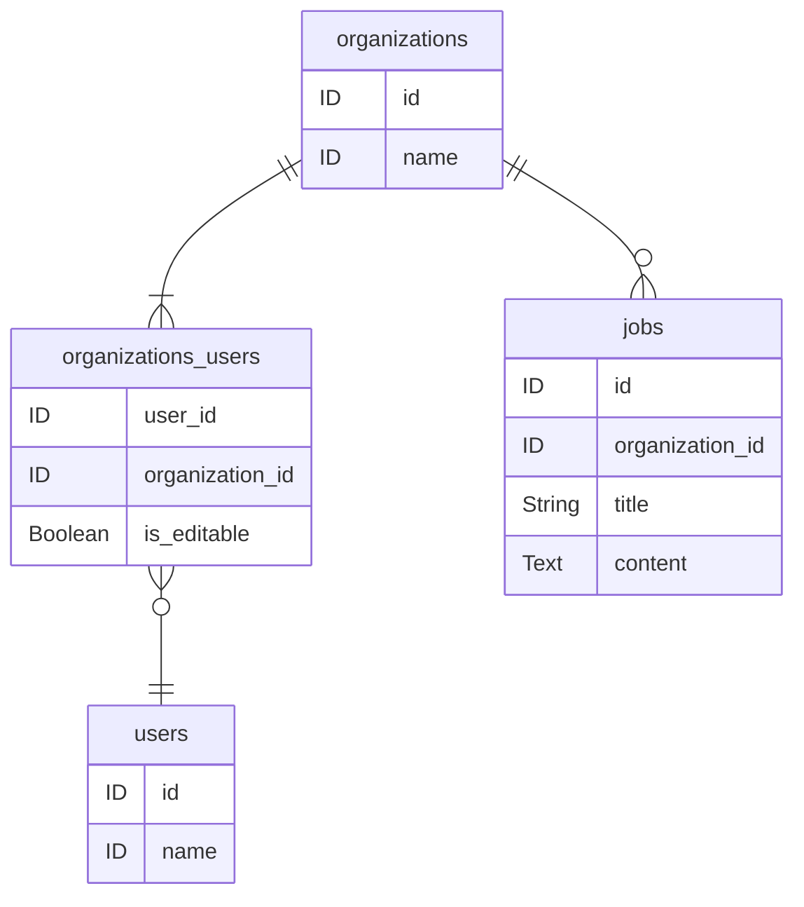

```mermaid
erDiagram
  organizations ||--|{ organizations_users : ""
  organizations_users }o--|| users : ""
  organizations ||--o{ jobs : ""

  organizations {
    ID id
    ID name
  }
  users {
    ID id
    ID name
  }
  organizations_users {
    ID user_id
    ID organization_id
    Boolean is_editable
  }
  jobs {
    ID id
    ID organization_id
    String title
    Text content
  }
```

| キー | 名称 |
| --- | --- |
| organization | 企業 |
| user | ユーザー |
| job | 仕事募集記事 |

- 企業は複数のユーザーを持てる
- 企業には1人以上の編集権限を持ったユーザーを持つ
- 企業は複数の仕事募集記事を持てる
