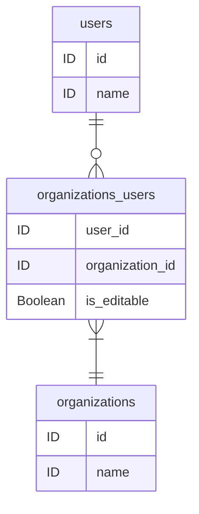

```mermaid
erDiagram
  users ||--o{organizations_users : ""
  organizations_users }|--||organizations : ""

  users {
    ID id
    ID name
  }
  organizations {
    ID id
    ID name
  }
  organizations_users {
    ID user_id
    ID organization_id
    Boolean is_editable
  }
```

| キー | 名称 |
| --- | --- |
| user | ユーザー |
| organization | 企業 |

- ユーザーは企業に所属できる
- 企業に所属しているユーザーは企業ページに表示される
- 企業に所属するユーザーは編集権限があれば、募集の作成/更新/削除を行うことができる
- 権限はまずは企業に所属するユーザーに対してread, writeくらいでよさそう
